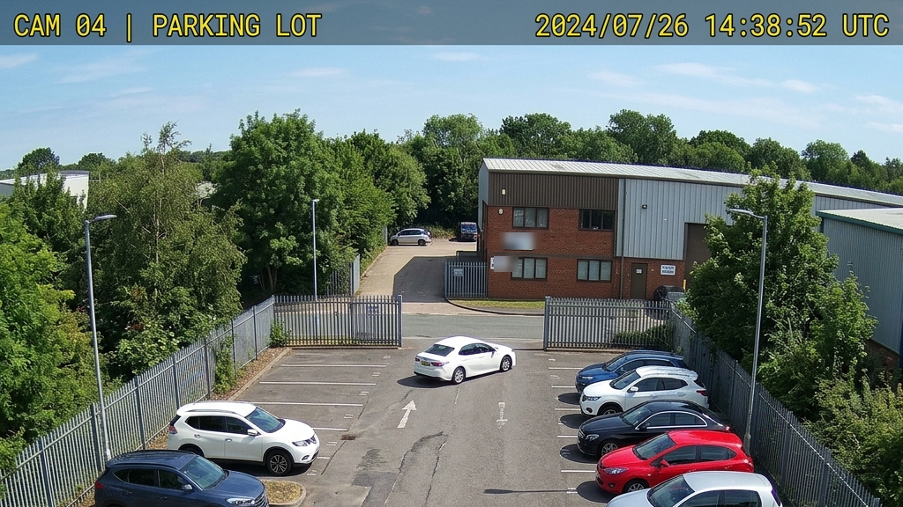
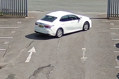
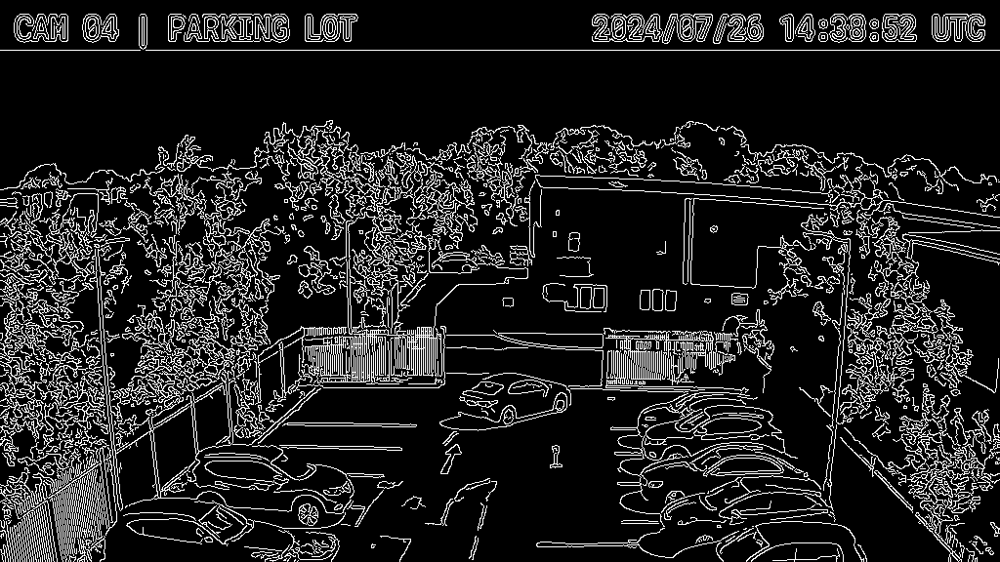

# SOC End-Term Project Report: Uni_Vision Concept Learning

**Name:** Swayam Lavangare
**Roll Number:** 24B4229
**Mentor:** Sayandeep Haldar
**Co-Mentor:** Dhruv Chaturvedi
**Program:** Seasons of Code (SOC)
**Duration:** Week 1 to Week 8

---

## Before You Read This

When I signed up for this project, I honestly thought I'd spend eight weeks "building an AI." I pictured myself downloading a model, feeding it some images, and watching it draw neat little boxes around cars. That is not what happened, and I'm glad it isn't.

My mentor pushed me to understand everything *underneath* the AI first. How a computer manages its own state. How data stays clean while it moves through a pipeline. How a frontend actually talks to a backend. And finally, the thing I didn't see coming: that an image is just a wall of numbers you can push around. By the time I reached the actual "AI" part in the last couple of weeks, none of it felt like magic. It felt like ordinary engineering, and that change in how I see things is probably the biggest thing I'm walking away with.

This report goes through all eight weeks in the order I actually lived them. I've tried to be honest about the parts that broke my brain and clear about the parts that finally clicked. It's less of a formal writeup and more the way I'd explain the project to a friend who asked what I did all summer.

---

## The Big Picture: What Uni_Vision Is

Uni_Vision is a visual AI pipeline. It takes a live camera feed, cleans it up, and reliably detects objects like vehicles in it. The catch is that a pipeline is only as strong as its weakest link. A brilliant model is useless if the camera loop crashes, or the data is malformed, or the dashboard leaks memory, or the API happily accepts garbage.

So the whole thing was built bottom-up. Each phase assumed the one before it actually worked:

| Phase | Weeks | Theme | What I Was Really Learning |
|-------|-------|-------|-----------------------------|
| Foundations | 1–2 | Control & Data | How systems think and how data stays safe |
| Communication | 3–4 | Frontend & Backend | How the pieces talk to each other |
| Orchestration | 5 | Workflow Design | How to arrange the pieces in the right order |
| Vision | 6–7 | Images & Preprocessing | How to turn pixels into math |
| Intelligence | 8 | Object Detection | How to judge and clean up predictions |

Weeks 1 to 4 made up my Mid-Term submission. Weeks 5 to 8 built directly on that and make up the second half of this report.

---

# Part 1: The Mid-Term Foundation (Weeks 1–4)

*A recap of the first half, looking back at it with everything I know now.*

## Week 1: Computing Without Fear & System Architecture

The idea here was simple to say and hard to do: before a camera can be smart, it has to be disciplined. It should only act when it's supposed to, and never step on its own feet.

I looked at the difference between constantly polling a sensor (asking "any motion? any motion?" forever, which wastes the CPU) and waiting quietly for an event to fire. Then I built the camera's brain as a small state machine. It can only be in one state at a time, `IDLE` or `ACQUIRING`, and it can only switch between them under strict conditions.

```python
camera_state = "IDLE"
frames_processed = 0
MAX_BUFFER = 5

while frames_processed < MAX_BUFFER:
    if hardware_interrupt_detected() and camera_state == "IDLE":
        camera_state = "ACQUIRING"
        try:
            current_frame = grab_frame_buffer()
            frames_processed += 1
        finally:
            camera_state = "IDLE"   # always release the lock, even on a crash
```

The quiet hero here is the `try...finally`. It makes sure the camera goes back to `IDLE` even if grabbing a frame blows up. Without it, one bad frame could leave the system stuck in `ACQUIRING` forever, never accepting new work. That's a deadlock, and it's exactly the kind of failure that's miserable to debug after the fact.

The hard part this week was mental, not technical. I had to stop thinking "code runs top to bottom" and start thinking "code reacts to events." It also took me an embarrassing number of tries to stop my `while` loop from spinning forever and eating my terminal.

---

## Week 2: Python As A Tool & Data Engineering

Models produce messy, unpredictable output. If I don't defend against that mess, the pipeline breaks quietly, which is the worst way for it to break. So this week was about keeping the data honest.

I read up on time complexity, the speed gap between lists and dictionaries, and, more usefully, type hints and writing tests before writing the logic. I stopped assuming the data would "probably be fine" and started actually checking.

```python
from typing import List, Dict, Union

BoundingBox = List[Union[int, float]]
DetectionResult = Dict[str, Union[str, float, BoundingBox]]

def filter_high_confidence_detections(predictions, threshold):
    return [p for p in predictions if p.get("confidence", 0.0) >= threshold]
```

I backed that filter with a unit test that asserts it keeps exactly the right boxes and drops the noise. The test is basically a promise to my future self: however the model's output changes later, this function either handles it or fails loudly and immediately instead of silently corrupting things downstream.

Writing tests felt like busywork at first. Then I hit my first genuinely ugly nested-dictionary bug, spent an hour on it, and never doubted the point of tests again. Type hints did the same thing for me. Once I added them, half my bugs started showing up while I was writing the code instead of while it was running.

---

## Week 3: Web Basics, React & the Virtual DOM

The pipeline is invisible without a face, so this week I built the dashboard that shows its status live. I also learned the hard way why doing this naively would grind the browser to a halt.

The key idea is the Virtual DOM. React doesn't repaint the whole screen when data changes. It works out the tiny difference in memory first and only updates the exact text that moved. That's how a dashboard can tick over at 30 FPS without stuttering.

```jsx
useEffect(() => {
    let isComponentMounted = true;
    const connectToPipeline = setInterval(() => {
        if (isComponentMounted) {
            setSystemMetrics({ state: "Processing Frame", fps: Math.floor(Math.random() * 15) + 30 });
        }
    }, 100); // 10Hz refresh

    return () => {                       // cleanup, the part that saved me
        isComponentMounted = false;
        clearInterval(connectToPipeline);
    };
}, []);
```

That `return () => clearInterval(...)` cleanup is what stops the memory leak. I know it stops the leak because I first wrote the version without it. Every re-render kicked off a *new* interval while the old ones kept running, and the tab crashed within a minute. Watching my own dashboard slowly strangle itself was a good, humbling way to learn what a cleanup function is for.

Async closures in JavaScript were the wall this week. The bug where my data stream multiplied on every render made no sense to me until I finally sat down and understood the component lifecycle properly.

---

## Week 4: APIs, the OSI Model & JSON Contracts

The frontend and the AI core need to talk, but the model should never receive junk. So this week I built the bouncer at the door: a strict, validated API.

I read about REST, the cost of serializing objects into JSON for transport, and where all this sits in the OSI model. Then I built an async FastAPI endpoint with Pydantic doing the validation.

```python
class InferenceRequestSchema(BaseModel):
    camera_id: str = Field(..., min_length=3, max_length=15)
    confidence_threshold: float = Field(..., ge=0.1, le=0.99)
    enable_gpu_accel: bool = True

@app.post("/api/v1/configure", response_model=InferenceResponseSchema)
async def configure_pipeline(payload: InferenceRequestSchema):
    # by the time we're here, payload is guaranteed valid
    ...
```

The nice part is that `Field(..., ge=0.1, le=0.99)` runs *before* my function does. Send a threshold of 1.5, or a `camera_id` that's too short, and Pydantic bounces it with a 422 before the bad data touches anything. And because the endpoint is `async`, the server can keep handling other requests while one of them waits, instead of freezing up one at a time.

The concept I had to fight with was `asyncio`. The gap between normal threading and an event loop took a lot of re-reading before it stuck.

---

## What the Mid-Term Looked Like

For context, my Mid-Term Report packaged Weeks 1 to 4 into a single document. Every week followed the same four-part shape, which I've kept going in this report:

1. **What I Studied & Researched**: the concept and why it matters to the pipeline.
2. **My Code Experiment**: a small piece of working code I wrote myself.
3. **A Closer Look**: a closer read of the tricky lines.
4. **My Progress This Week**: what I finished, the milestones, and what fought back.

It opened with a short executive summary explaining the philosophy (get the foundations right before touching the AI) and came with a plain-text summary of what I'd finished and where I'd gotten stuck. The whole thing was in Markdown so it rendered cleanly on the repo. This end-term report is cut from the same cloth, just stretched across all eight weeks.

---

# Part 2: The Foundation Phase (Weeks 5–8)

*Where the pipeline stopped being abstract plumbing and started actually seeing things.*

## Week 5: Block-Based Workflow Design (Graph Theory)

By now I had a pile of working parts: a camera loop, a data filter, a dashboard, an API. The new problem was ordering. How do you connect them so they run in the right sequence every time, without one block firing before its inputs are ready?

The answer turned out to be graph theory, specifically a Directed Acyclic Graph. I modeled the pipeline as a graph where each block points to whatever depends on it, then wrote a topological sort (using depth-first search) to compute a safe order.

```python
pipeline_graph = {
    "LoadImage":    ["Grayscale", "Resize"],
    "Grayscale":    ["DetectObjects"],
    "Resize":       ["DetectObjects"],
    "DetectObjects":["SaveResult"],
    "SaveResult":   []
}

def topological_sort(graph):
    visited, stack = set(), []
    def dfs(node):
        if node not in visited:
            visited.add(node)
            for neighbor in graph.get(node, []):
                dfs(neighbor)
            stack.append(node)
    for key in graph:
        dfs(key)
    return stack[::-1]
```

The "acyclic" part is the whole safety story. No block can feed backwards into an earlier one, so the pipeline can't trap itself in a loop. My DFS guarantees that `DetectObjects` never runs until both `Grayscale` and `Resize` are done. This is genuinely how tools like Blender's node editor or ComfyUI validate their graphs, which was a fun thing to realize.

Recursion and graph traversal took real effort. Getting the algorithm to tell a separate branch apart from a deep dependency, without looping forever, was the hardest logic I'd written up to that point.

---

## Week 6: Images As Arrays (Computer Vision Foundations)

This is the week it got real. I finally learned the thing that sits under all of computer vision: an image isn't a picture, it's a grid of numbers.

With OpenCV and NumPy, I loaded a camera frame and pushed it around purely as a matrix. Checked its shape, converted it to grayscale, cropped out a region, resized it, and normalized it.

```python
import cv2, numpy as np

image_matrix = cv2.imread("camera_frame.jpg")
height, width, channels = image_matrix.shape      # (576, 1024, 3)

gray_matrix   = cv2.cvtColor(image_matrix, cv2.COLOR_BGR2GRAY)  # (576, 1024)
roi_cropped   = image_matrix[360:520, 400:640]                  # slice out the white sedan
resized_roi   = cv2.resize(roi_cropped, (224, 224))             # standard model input
normalized    = resized_roi.astype(np.float32) / 255.0          # squash to 0.0–1.0
```

Here's the proof from my own run:


*The raw `image_matrix`, loaded straight off the feed as a 3-channel NumPy array.*


*The `roi_cropped` matrix, isolating the subject so the model doesn't waste effort on the background.*

Two ideas locked in. First, channels: a color image is `(Height, Width, 3)` for blue, green, red, and grayscale collapses that to one channel to simplify things. Second, normalization: dividing by 255 pulls pixel values from the 0 to 255 range down into 0 to 1, which keeps the network's weights well-behaved during inference.

The thing that tripped me up for way too long was that image dimensions are `(Height, Width, Channels)`, not the `(X, Y)` order I'd used my whole life. That one flip caused a bunch of off-by-everything bugs before it finally sank in.

---

## Week 7: Preprocessing & Frame Efficiency

A raw frame, especially from a grainy low-light security feed, is full of stuff the model doesn't need. This week was about cleaning and simplifying it so the model only looks at what matters, which also saves GPU time.

I built a short chain: blur out the noise, threshold to split subject from background, then pull out clean outlines with Canny edge detection.

```python
import cv2

frame       = cv2.imread("night_feed.jpg", cv2.IMREAD_GRAYSCALE)
blurred     = cv2.GaussianBlur(frame, (5, 5), 0)          # kill grainy noise
_, thresh   = cv2.threshold(blurred, 127, 255, cv2.THRESH_BINARY)  # subject pops out
edges       = cv2.Canny(blurred, 50, 150)                 # trace object outlines
```

The result:


*The `edges` matrix. Clean outlines like these make an object's shape easy for a model to read, without any of the distracting texture.*

Each step does one job. The Gaussian blur averages out random pixel noise. The binary threshold forces every pixel to pure black or white so the subject stands out. And Canny looks at how sharply intensity changes across neighboring pixels to draw the outlines, so the model recognizes a shape instead of chewing through surface detail it doesn't care about.

Tuning was the frustrating part, and there's no clean formula for it. Too strict and the car vanished completely. Too loose and camera noise drowned the real edges. I spent most of the week adjusting the blur size and the edge cutoffs by feel, which taught me that a lot of vision work is just patient tuning.

---

## Week 8: Object Detection (IoU & NMS)

The finale. Detectors are notorious for drawing several overlapping boxes around the same object, so this week I learned the math that scores a box and throws out the duplicates. I coded it from scratch instead of importing a library, because I wanted to actually understand it.

Intersection over Union measures how well two boxes overlap. Non-Maximum Suppression uses that measure to drop the redundant boxes and keep the most confident one per object.

```python
def calculate_iou(boxA, boxB):
    xA, yA = max(boxA[0], boxB[0]), max(boxA[1], boxB[1])
    xB, yB = min(boxA[2], boxB[2]), min(boxA[3], boxB[3])
    interArea = max(0, xB - xA) * max(0, yB - yA)
    boxAArea = (boxA[2]-boxA[0]) * (boxA[3]-boxA[1])
    boxBArea = (boxB[2]-boxB[0]) * (boxB[3]-boxB[1])
    return interArea / float(boxAArea + boxBArea - interArea)

def simple_nms(boxes, scores, iou_thresh):
    order = sorted(range(len(boxes)), key=lambda i: scores[i], reverse=True)
    keep = []
    for i in order:
        if all(calculate_iou(boxes[i], boxes[k]) <= iou_thresh for k in keep):
            keep.append(i)
    return keep
```

IoU is a nice honest number. Take the overlapping area, divide by the combined area, and you get one value for how well a box fits. NMS leans entirely on that: two boxes over the same car score a high IoU, so the loop keeps the confident one and drops the other, leaving clean separate detections. This is the same post-processing that runs inside YOLO, SSD, and Faster R-CNN, which felt like a satisfying place to end up.

The tricky bit was making the NMS loop drop true duplicates without also deleting two objects that happen to sit close together. That distinction cost me a few painful debugging sessions, but getting it right felt like the right note to finish the summer on.

---

# Part 3: What I Actually Learned From SOC

Eight weeks in, here's what genuinely changed. Not the polished resume version, the real one.

**AI is mostly engineering.** I came in expecting to live inside neural networks. I spent most of my time on state machines, type safety, API contracts, and image math instead, because that scaffolding is what decides whether the "smart" part ever runs. The model is the tip of the iceberg, and I have a lot more respect for the iceberg now.

**Foundations first, even when it's slow.** Making me build the plumbing before touching computer vision felt like a detour at the time. By Week 8 it was obviously the right call. I could think clearly about object detection precisely because I already understood data flow, control, and validation. Patience early pays off later.

**Fail loudly, not quietly.** Type hints, unit tests, Pydantic, `try...finally`. The same theme kept coming back all summer: catch the error at the door instead of deep inside. A system that crashes with a clear message beats one that limps along corrupting data. This is the habit I think I'll keep the longest.

**Build it from scratch if you want to understand it.** I could have imported a library for topological sort, or IoU, or edge detection. Coding them by hand, and debugging them late at night, is the reason I actually understand them now instead of just knowing they exist. The struggle was the point.

**Being stuck is a skill.** React memory leaks, the FSM deadlock, the `(Height, Width)` confusion, tuning that made cars disappear. Every week had a wall. I got noticeably better at sitting with a problem, narrowing it down, and grinding through it, and that feels bigger than any single line of code.

**The concepts connect.** The `O(n)` filter from Week 2, the graph ordering from Week 5, the normalized tensors from Week 6, the NMS filter from Week 8. They aren't separate lessons. They're the same pipeline seen from different heights. Learning to see software as one connected system instead of a folder of loose files is the mindset I'm leaving with.

---

## Closing Thoughts

Uni_Vision started as an intimidating phrase, "build a visual AI system," and slowly turned into a set of problems I could take apart with my own hands. I didn't just learn what a pipeline is. I learned why every piece is there and what breaks when it's missing.

Thanks to my mentor, Sayandeep Haldar, and my co-mentor, Dhruv Chaturvedi, for making me learn the fundamentals instead of taking the shortcut. It was the harder path, and it's the reason I can read this report back and understand every line I wrote.

I'm proud of how far this went. From a `while` loop I kept crashing in Week 1, to hand-written object-detection post-processing in Week 8. More than the code, I'm leaving with a way of thinking about systems that I simply didn't have eight weeks ago.

**— Swayam Lavangare (24B4229)**
*Seasons of Code, Uni_Vision Concept Learning*
