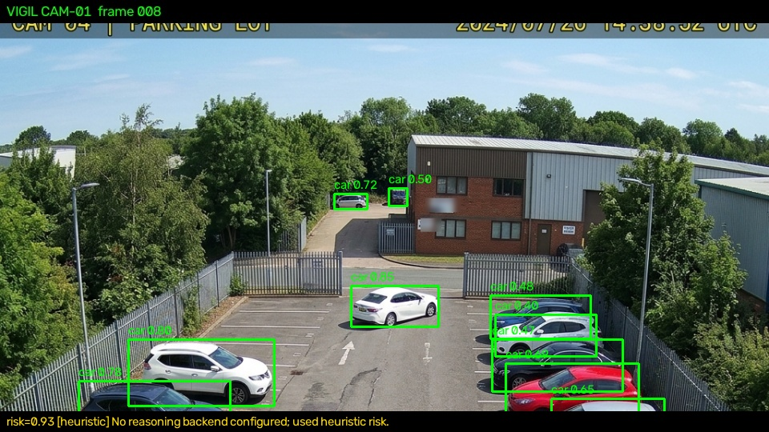
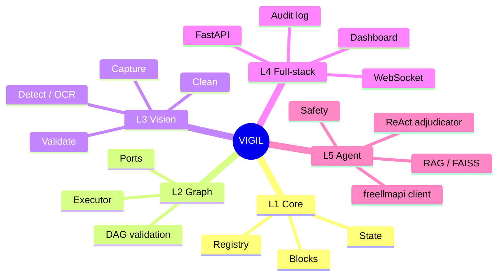
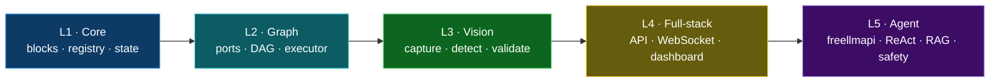
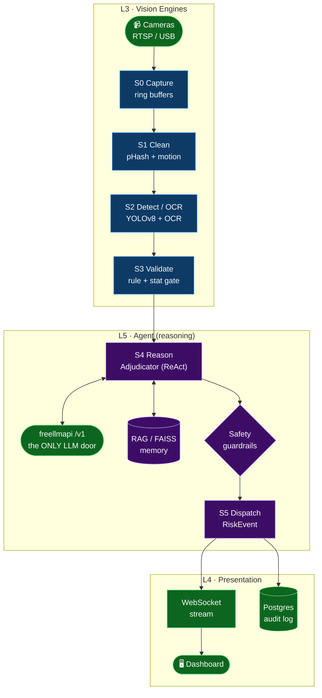
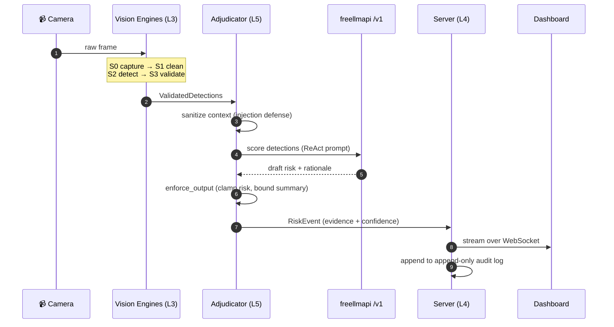
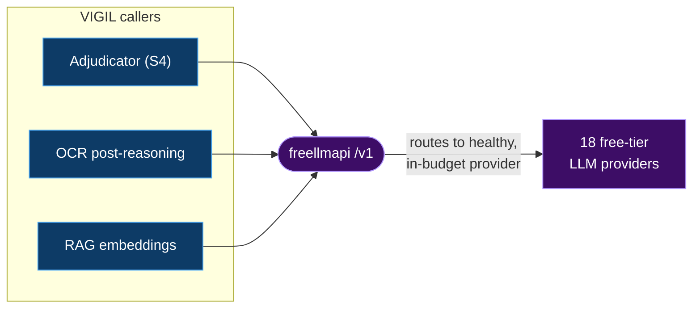

<div align="center">

# ⚡ VIGIL

### Visual Intelligence Graph &amp; Inference Layer

**A block-graph, real-time computer-vision platform with a single, swappable free-tier LLM reasoning core — [freellmapi](https://github.com/tashfeenahmed/freellmapi).**

_Turn any camera stream into risk-scored, human-readable, auditable events — through a pipeline of small, inspectable decisions instead of one opaque model._

<br/>

[](./LICENSE)
[](./pyproject.toml)
[](./server)
[](./.github/workflows/ci.yml)
[](https://github.com/tashfeenahmed/freellmapi)
[](#-project-status)
[-teal.svg)](#-the-five-layers-univision-learning-map)

</div>

---

## 🎓 SOC End-Term Submission — Swayam Lavangare (24B4229)

> **Mentor:** Sayandeep Haldar · **Co-Mentor:** Dhruv Chaturvedi
> This is my end-term submission: a clone of VIGIL with the **YOLOv8 detection
> core implemented and wired in**, two scaffold bugs fixed, the full graph
> pipeline run over a generated feed, and the detector **evaluated on a labeled
> dataset**. Evaluation scores, methodology, and reproduction steps are below.

### 1. Detection evaluation (YOLOv8n on labeled COCO8)

The S2 Detect stage uses Ultralytics **YOLOv8n**. Validated on the labeled
**COCO8** dataset (`tools/evaluate.py` → `results/metrics.json`):

| Metric | Score |
|--------|-------|
| **mAP@0.50** | **0.888** |
| **mAP@0.50–0.95** | **0.629** |
| mAP@0.75 | 0.635 |
| Precision | 0.621 |
| Recall | 0.833 |
| Inference speed (CPU) | ~41 ms / image |

*Backend: PyTorch 2.13 CPU, Intel Core i7-14650HX. COCO8 = 4 val images, 17 instances.*

### 2. End-to-end pipeline on a generated feed

The full graph `image_capture → clean → detect(YOLOv8) → validate → reason`
was run over a **9-frame generated feed** (`datasets/generated_feed/`, both
frames and `feed.mp4`) via `tools/run_feed.py`:

| Result | Value |
|--------|-------|
| Frames processed | 9 |
| Valid detections | 26 |
| Avg detections / frame | 2.89 |
| Max risk score | 0.927 |
| Classes detected | car (10), bowl (3), broccoli (2), person (2), + 9 others |

Annotated outputs (boxes + per-frame risk banner) are in `results/annotated/`;
per-frame events with detections and risk scores are in `results/events.json`.



*YOLOv8 detecting vehicles on a CCTV parking-lot frame, scored `risk=0.93`.*

### 3. What I changed (testing + architecture revamps)

- **Implemented the missing YOLO backend** — `engines/yolo_detector.py`:
  `YoloDetector` (a callable wired into the existing `DetectBlock`) + a real
  `ImageCaptureBlock` that reads pixels from image folders or video feeds.
- **Fixed 2 scaffold bugs** so the suite is green (14/14 passing):
  - `Block.__init__` ignored a `config=` mapping (nested it) → blocks silently
    lost their config; now accepts both `config=` and keyword args.
  - `Adjudicator` heuristic fallback built a `RiskEvent` without the required
    `frame_index` → `TypeError`; now supplied.
- **Added eval tooling** — `tools/evaluate.py` (metrics) and `tools/run_feed.py`
  (full pipeline over a feed), plus `requirements.txt`.

### 4. Datasets attached (per submission brief)

- `datasets/coco8/` — labeled evaluation set (images + YOLO labels).
- `datasets/generated_feed/` — the generated feed: `frames/` + `feed.mp4`.

### 5. Reproduce

```bash
pip install torch torchvision --index-url https://download.pytorch.org/whl/cpu
pip install -r requirements.txt
pytest -q                       # 14 passed
python tools/evaluate.py        # -> results/metrics.json
python tools/run_feed.py        # -> results/events.json + results/annotated/
```

### 6. Reasoning core (freellmapi) — note

The pipeline runs with the built-in **heuristic risk fallback**, so it produces
scores with no keys. To enable the LLM reasoning core, add a **freellmapi swarm**
(multiple free keys for quota-free throughput) to `.env`:

```env
FREELLMAPI_BASE_URL=http://localhost:8080
FREELLMAPI_API_KEY=your-key-or-swarm-token
FREELLMAPI_MODEL=auto
```

With those set, `agent/freellmapi_client.py` replaces the heuristic with real
LLM adjudication; without them it degrades gracefully (never hard-fails).

---

## 📍 Table of Contents

- [What is VIGIL?](#-what-is-vigil)
- [Reference Lineage](#-reference-lineage-standing-on-four-shoulders)
- [The Five Layers](#-the-five-layers-univision-learning-map)
- [System Architecture](#-system-architecture)
- [The Pipeline (S0–S5)](#-the-pipeline-s0s5)
- [The AI Core — freellmapi only](#-the-ai-core--freellmapi-only)
- [Data Contracts](#-data-contracts)
- [Quickstart](#-quickstart)
- [Repository Layout](#-repository-layout)
- [Safety Model](#-safety-model-non-negotiable)
- [Project Status](#-project-status)
- [License & Attribution](#-license--attribution)

---

## 🧭 What is VIGIL?

VIGIL runs a live camera feed through a **validated block-graph** — `capture → clean → detect → validate → reason → report → store` — emitting a bounded, evidence-carrying `RiskEvent` at the end of every cycle.

The design philosophy is deliberate:

> **Not one big model. A pipeline of small, inspectable, swappable decisions.**

Each stage is a typed **Block** with declared input/output **ports**, wired into a **directed acyclic graph (DAG)** that is validated *before* it ever runs. The reasoning layer is intentionally centralized: **every LLM call in VIGIL goes to one place — the [freellmapi](https://github.com/tashfeenahmed/freellmapi) endpoint.** VIGIL never loads model weights, never runs a local model, and never hardcodes a provider. It speaks a single OpenAI-compatible `/v1` contract, and freellmapi handles routing, failover and provider selection behind that one door.



---

## 🧬 Reference Lineage: Standing on Four Shoulders

VIGIL is a **synthesis** — it borrows one hard-won idea from each of four production-grade open-source projects and fuses them into a single coherent stack. The concept cards below link to each upstream repository.

<table>
  <tr>
    <td width="50%" valign="top" align="center">
      <a href="https://github.com/roboflow/inference">
        
      </a>
      <br/><br/>
      <b>What VIGIL borrows:</b> the <i>Visual Workflow</i> editor, model-chaining <b>blocks</b>, and the live-video <code>InferencePipeline</code> abstraction — the idea that CV should be <i>composed, not coded</i>.
    </td>
    <td width="50%" valign="top" align="center">
      <a href="https://github.com/pysource-com/VisoNode">
        
      </a>
      <br/><br/>
      <b>What VIGIL borrows:</b> the <i>no-code node graph</i> UX — wire a <b>camera → YOLO → live output</b> visually, with zero boilerplate, so a graph is something you <i>draw</i>.
    </td>
  </tr>
  <tr>
    <td width="50%" valign="top" align="center">
      <a href="https://github.com/SharpAI/DeepCamera">
        
      </a>
      <br/><br/>
      <b>What VIGIL borrows:</b> <i>agentic camera reasoning</i> + edge alerting — the notion that a camera can <i>reason about a scene</i>, not just detect boxes. (In VIGIL that reasoning is delegated to freellmapi, never a local model.)
    </td>
    <td width="50%" valign="top" align="center">
      <a href="https://github.com/GetStream/Vision-Agents">
        
      </a>
      <br/><br/>
      <b>What VIGIL borrows:</b> the clean <b>detector ↔ reasoning-LLM split</b> inside a low-latency processor pipeline — <i>fast perception, slow deliberation</i>, cleanly separated.
    </td>
  </tr>
</table>

> ℹ️ **Attribution:** These upstream projects are independent works by their respective authors under their own licenses. VIGIL re-implements *concepts and interfaces* for learning purposes; it vendors none of their code, weights, or models.

---

## 📚 The Five Layers (UniVision Learning Map)

VIGIL is structured as five stacked layers. Each maps 1:1 to a directory and to a rung on the UniVision learning ladder — read the codebase bottom-up and you learn the whole stack.

| Layer | Domain | Responsibility | Lives in |
|:-----:|--------|----------------|----------|
| **L1** | Computational core | Variables, logic, state, block/registry primitives, pipelines | `core/` |
| **L2** | Visual programming | Blocks, ports, connections, DAG validation, execution order | `core/graph/` |
| **L3** | Computer vision | Frames, preprocessing, YOLO detection, OCR, tracking, anomaly | `engines/` |
| **L4** | Full-stack | FastAPI, WebSocket streaming, dashboard, queue, storage, metrics | `server/`, `frontend/` |
| **L5** | Agentic AI | freellmapi client, ReAct adjudication, RAG/FAISS, safety & human oversight | `agent/` |



---

## 🏗️ System Architecture



> The graph is **validated before execution**: every edge is a typed port contract, so a malformed pipeline fails at build time — never mid-stream on a live camera. Note there is exactly **one** LLM node in the entire graph: `freellmapi /v1`.

---

## 🔁 The Pipeline (S0–S5)

One pass over a single frame, end to end. Perception is fast and local; deliberation is a single remote call to freellmapi.



| Stage | Block | Guarantee |
|:-----:|-------|-----------|
| **S0** | `CaptureBlock` | Monotonic frame index; deterministic stub when no camera |
| **S1** | `CleanBlock` | Normalized geometry + color space for inference |
| **S2** | `DetectBlock` | Empty-but-valid output when no detector backend is present |
| **S3** | `ValidateBlock` | Drops low-confidence / malformed boxes; reports `dropped` count |
| **S4** | `Adjudicator` | Reasoning via **freellmapi only**; deterministic heuristic fallback when offline |
| **S5** | `Dispatch` | Bounded `RiskEvent` — `0.0 ≤ risk ≤ 1.0`, summary ≤ 280 chars |

---

## 🧠 The AI Core — freellmapi only

> 🔒 **Hard rule.** VIGIL has exactly **one** reasoning core: **[freellmapi](https://github.com/tashfeenahmed/freellmapi)**. There are **no local models**, **no bundled open-source weights**, and **no hardcoded provider names** anywhere in the codebase. Every chat, embedding, audio and image call flows through this single OpenAI-compatible `/v1` endpoint.



**Why a single door?**

- **Base URL:** `http://freellmapi:8080/v1` — one endpoint for chat, embeddings, audio and images.
- **Smart routing:** freellmapi picks the highest-priority *healthy, in-budget* provider; sticky sessions for 30 min.
- **Automatic failover:** transparent `429`/`5xx` fallback across the provider chain; embedding failover is locked to the same vector dimension so FAISS never breaks.
- **Zero coupling:** VIGIL code names no provider and loads no weights — swapping providers is a freellmapi config change, invisible to VIGIL.

```yaml
# config/llm.yaml (illustrative) — the ONLY place a model backend is referenced
base_url: http://freellmapi:8080/v1   # freellmapi is the sole LLM core
token: ${VIGIL_LLM_TOKEN}             # freellmapi-...
routing: priority-healthy-in-budget
sticky_session_minutes: 30
# note: no model name is hardcoded — freellmapi decides at call time
```

---

## 📦 Data Contracts

Every block speaks in typed dataclasses, so the graph is verifiable end to end. The two central contracts:

```python
@dataclass
class ValidatedDetections:
    frame_index: int          # monotonic, from S0
    detections: list[Box]     # class, bbox, confidence
    dropped: int              # boxes removed at S3
    source: str               # camera id / stream url

@dataclass
class RiskEvent:
    risk: float               # clamped 0.0 .. 1.0
    label: str                # e.g. "perimeter_breach"
    summary: str              # <= 280 chars, bounded
    evidence: list[Box]       # boxes that drove the decision
    confidence: float         # 0.0 .. 1.0
    timestamp: str            # ISO-8601, UTC
    source: str               # provenance for audit
```

---

## 🚀 Quickstart

```bash
# 1. Configure
cp .env.example .env          # set VIGIL_LLM_TOKEN=freellmapi-...

# 2. Bring the stack up
docker compose up -d          # api :8000 · web :5173 · freellmapi :8080 · grafana :3000

# 3. Validate every block + example DAG
python tools/validate.py

# 4. Open the dashboard — drag blocks, wire a graph, hit Run
open http://localhost:5173
```

Run a workflow **headless**:

```bash
curl -X POST localhost:8000/v1/analyze \
  -H "Content-Type: application/json" \
  -d '{"workflow":"perimeter_safety","source":"rtsp://cam-1/stream"}'
```

Local development (no Docker):

```bash
python -m venv .venv && source .venv/bin/activate
pip install -e ".[dev]"
pytest -q                                       # run the test suite
uvicorn server.app:create_app --factory --reload  # serve the API
```

---

## 📂 Repository Layout

```text
vigil/
├─ core/        # L1 computational core: blocks, registry, state
│  └─ graph/    # L2 DAG wiring, port contracts, executor
├─ engines/     # L3 vision: capture · clean · detect · validate + shared types
├─ agent/       # L5 freellmapi client · adjudicator · safety · rag · tools
├─ server/      # L4 FastAPI app · routes · schemas · WebSocket · metrics
├─ frontend/    # L4 dashboard: index.html · styles.css · app.js
├─ config/      # settings + pipeline.yaml (declarative S0–S3 DAG) + llm.yaml
├─ tests/       # pytest suites (test_engines, test_agent, ...)
├─ .github/     # CI: pytest matrix + ruff lint
├─ ARCHITECTURE.md  CONTRIBUTING.md  docker-compose.yml  pyproject.toml  Makefile
└─ README.md
```

---

## 🛡️ Safety Model (Non-Negotiable)

The agent tool layer is treated as an **untrusted boundary in, bounded contract out**:

- **Evidence-first:** every AI event carries evidence, timestamp, source and confidence.
- **Human-in-the-loop:** high-stakes actions require explicit human approval.
- **Injection defense:** free text reaching the reasoning core passes through `agent.safety.sanitize_text`.
- **Output contract:** freellmapi output passes `enforce_output` — risk clamped to `[0,1]`, summary bounded, label defaulted.
- **Auditability:** an append-only audit log guards the tool layer.
- **Single trust surface:** because reasoning is centralized in freellmapi, there is exactly one outbound AI boundary to secure — no local model to sandbox, patch, or supply-chain audit.

---

## 📊 Project Status

> **Concept reference repository.** Interfaces, stubs and the five-layer architecture are complete and validated; provider keys are user-supplied to freellmapi. Every block runs a deterministic stub path so the graph stays importable, testable, and GPU-free out of the box.

| Phase | Layer | State |
|:-----:|-------|:-----:|
| 1 | Skeleton | ✅ |
| 2 | L1 Core | ✅ |
| 3 | L3 Engines | ✅ |
| 4 | L5 Agent (freellmapi) | ✅ |
| 5 | L4 Server | ✅ |
| 6 | L4 Frontend | ✅ |
| 7 | Config / CI | ✅ |
| 8 | Tests | ✅ |

---

## 📜 License & Attribution

VIGIL is released under the **[Apache-2.0](./LICENSE)** license. It is an educational synthesis inspired by — and crediting — four upstream projects: [roboflow/inference](https://github.com/roboflow/inference) · [pysource-com/VisoNode](https://github.com/pysource-com/VisoNode) · [SharpAI/DeepCamera](https://github.com/SharpAI/DeepCamera) · [GetStream/Vision-Agents](https://github.com/GetStream/Vision-Agents) — with **all reasoning powered exclusively by [tashfeenahmed/freellmapi](https://github.com/tashfeenahmed/freellmapi)**. All trademarks and code belong to their respective owners.

<div align="center">

**Built as a layered learning map · read it bottom-up (L1 → L5) and you learn the whole stack.**

</div>
